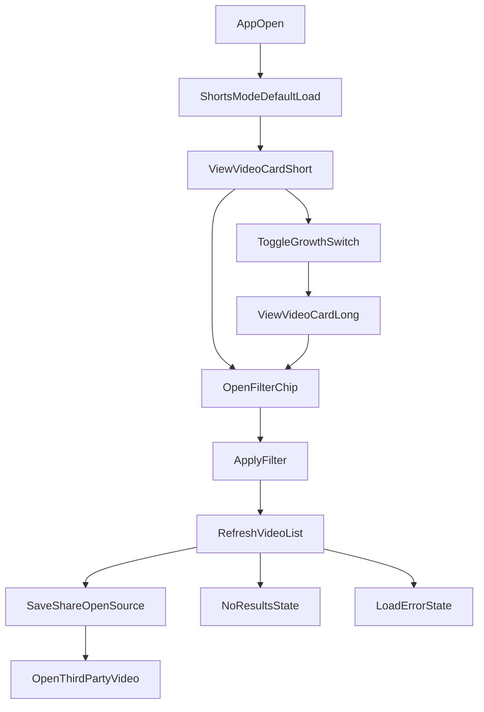

# GrowQR Video POC User Flow and Interaction Spec

## 1) End-to-End User Flow

## 2) Primary Journeys

## Journey A: Fast discovery (Shorts first)
1. User lands in Shorts mode.
2. First card is visible above fold.
3. User taps `Save` or `Open Source` directly from card action row.

## Journey B: Deliberate learning (Switch to Longs)
1. User toggles `GrowthSwitch` to `Longs`.
2. Long cards load with richer context.
3. User filters by `Duration` or `Skill Level`.
4. User opens source video.

## Journey C: Refine intent
1. User opens chips (`Career Path`, `Source`).
2. Applies filter.
3. List updates with loading skeleton.
4. Either results appear, or empty-state guidance is shown.

## 3) Component State Matrix

## `GrowthSwitch`
- **Default:** `Shorts` active.
- **Hover/press:** subtle surface tint change.
- **Active:** accent-filled segment + semibold label.
- **Focus-visible:** 2px focus ring using `--color-border-focus`.
- **Disabled:** reduced opacity, no pointer events.

## `VideoCardShort`
- **Default:** 9:16 media area, compact metadata.
- **Hover/press:** shadow elevation from `--shadow-sm` to `--shadow-md`.
- **Loading:** skeleton placeholder matching title + pill + action row.
- **Error:** fallback media thumbnail + short message and retry affordance.

## `VideoCardLong`
- **Default:** 16:9 thumbnail with title, context line, duration, source badge.
- **Selected/saved:** bookmark icon filled and label changes to `Saved`.
- **Loading/error:** same behavior model as short card.

## `FilterChip`
- **Default:** outline style with neutral text.
- **Active:** filled with surface-selected color + trailing clear icon.
- **Focus-visible:** ring + offset.
- **Disabled:** muted text and border.

## `SourceBadge` and `DurationPill`
- Always visible on cards.
- Must preserve legibility over any media using soft backdrop or solid pill background.

## 4) Interaction Rules

- Any filter or mode switch triggers visible loading feedback within 150ms.
- Use decelerated entry for card refresh (`200ms`), accelerated exit for old content (`150ms`).
- Keep transitions to transform/opacity where possible.
- Preserve scroll position if user reopens the same mode during one session.

## 5) Edge States

## Loading State
- Render at least 3 skeleton cards.
- Keep top controls interactive unless initial app bootstrap is still loading.

## Empty State
- Title: `No videos match these filters`
- Support: `Try changing Source or Duration`
- CTA: `Reset filters`

## Error State
- Title: `Could not load videos`
- Support: `Please check your network and retry`
- CTA: `Try again`
- Keep latest successful content cached if available.

## 6) Accessibility Specification

- **Contrast:** text and controls target WCAG AA (`4.5:1` minimum for body text).
- **Touch target:** minimum `44x44`.
- **Keyboard path:** top rail -> `GrowthSwitch` -> chips -> visible card actions.
- **Focus visible:** never remove focus indicator.
- **Semantics:**
  - `GrowthSwitch` as segmented control with `aria-pressed` or tablist semantics.
  - Chips announce filter and selected state.
  - Action buttons have meaningful labels (`Save video`, `Open source video`).
- **Screen reader announcements:**
  - On filter apply: polite status (`12 videos found`).
  - On error: assertive alert.
- **Reduced motion:**
  - Replace movement-heavy transitions with opacity-only transitions.

## 7) Figma Frame Guidance (for handoff)

- Frame set:
  - `Mobile/Shorts Default`
  - `Mobile/Longs Active`
  - `Mobile/Filter Applied`
  - `Mobile/Empty State`
  - `Mobile/Error State`
- Include component variants for:
  - `GrowthSwitch` (2 states)
  - `VideoCardShort` (default/loading/error/saved)
  - `VideoCardLong` (default/loading/error/saved)
  - `FilterChip` (default/active/disabled)

## 8) Critique Protocol Pass (Self-Review)

## Swap Test
- If replaced with generic social styling, GrowQR intent weakens.
- Current spec preserves identity through readiness framing and `GrowthSwitch`.

## Squint Test
- Primary structure remains clear: mode selection, then card content, then actions.

## Signature Test
Distinct signature elements applied in at least five places:
1. Growth mode segmented control.
2. Readiness-oriented subtitle and microcopy.
3. Format-aware card architecture (short vs long).
4. Source trust badge prominence.
5. Skill-growth contextual metadata.

## Token Test
- Tokens are role-based and product-specific (`gq-*`, readiness emphasis), not generic-only placeholders.
